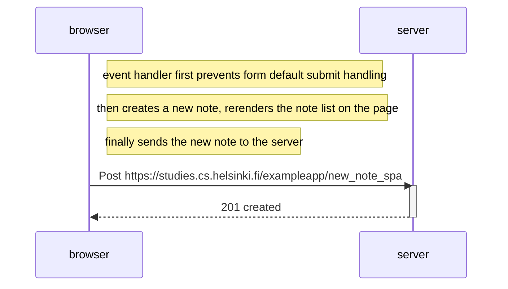

```mermaid
    sequenceDiagram
    participant browser
    participant server

    note right of browser: event handler first prevents form default submit handling
    note right of browser: then creates a new note, rerenders the note list on the page
    note right of browser: finally sends the new note to the server

    browser->>server: Post https://studies.cs.helsinki.fi/exampleapp/new_note_spa
    activate server
    server-->>browser: 201 created
    deactivate server
```